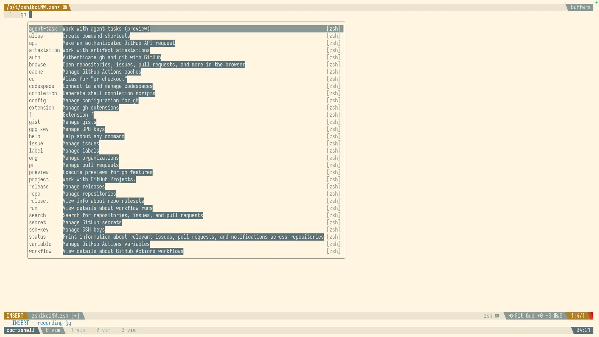
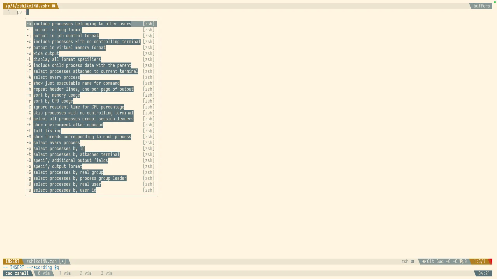
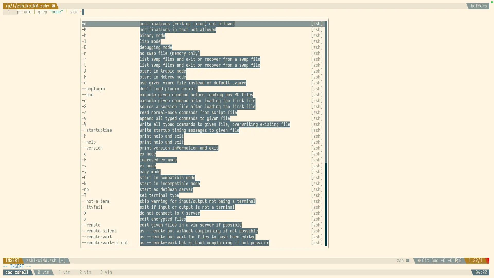
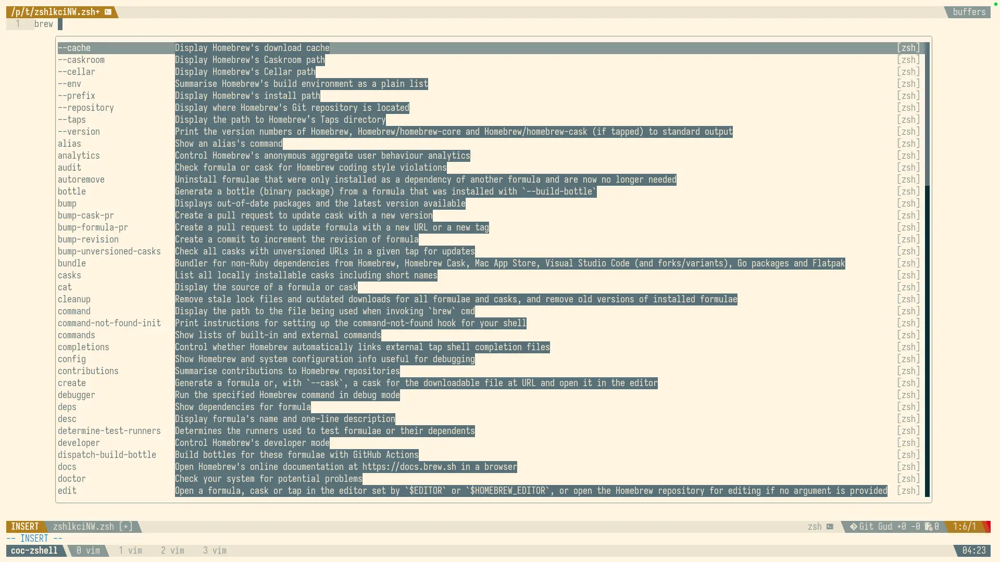

# coc-zshell

Zsh completion support for coc.nvim using the native zsh completion system.

## Install

```vim
:CocInstall coc-zshell
```

## What it does

This extension provides zsh autocompletion directly in your Neovim buffers when editing zsh/sh files. It leverages the native zsh completion system, including brew completions and any custom completion paths you've configured.

## Configuration

Two options are available:

- `coc-zshell.enabled` (boolean, default: `true`) - Enable/disable the extension
- `coc-zshell.timeout` (number, default: `5000`) - Timeout for completion requests in milliseconds

## Use with vi-mode in terminal

If you use vi-mode in your terminal, this extension becomes particularly powerful. Add this to your `.zshrc`:

```zsh
export KEYTIMEOUT=1

autoload -Uz add-zsh-hook
autoload -Uz edit-command-line
zle -N edit-command-line

bindkey -v
bindkey -M vicmd 'v' edit-command-line
bindkey '^A' beginning-of-line
bindkey '^E' end-of-line

function zle-keymap-select {
    case ${KEYMAP} in
        (vicmd)      echo -ne '\e[1 q';;
        (main|viins) echo -ne '\e[5 q';;
    esac
}

zle -N zle-keymap-select
```

With this setup, press `ESC` in your terminal to enter normal mode (just like in vim), then press `v` to open the current command line in a vim buffer. Edit your zsh commands with full autocompletion support, save and close to execute.

## Custom ZDOTDIR support

This extension respects custom zsh configuration directories. If you have a custom `ZDOTDIR` set in your `~/.zshenv`:

```zsh
export ZDOTDIR="$HOME/.config/zsh"
```

The extension will correctly load your zsh configuration and all associated completions (tested on macOS).

## Credits

This extension builds heavily on the excellent work from:

- [coc-zsh](https://github.com/tjdevries/coc-zsh) by tjdevries
- [vim-zsh-completion](https://github.com/Valodim/vim-zsh-completion) by Valodim

I've made minimal modifications to support brew completions and custom `ZDOTDIR` configurations.

## Contributing

Contributions, issues, and feedback are warmly welcomed! This extension has primarily been tested on macOS. If you're on Linux and encounter any issues (or if it works perfectly), please let me know.

## Screenshots







## License

MIT
